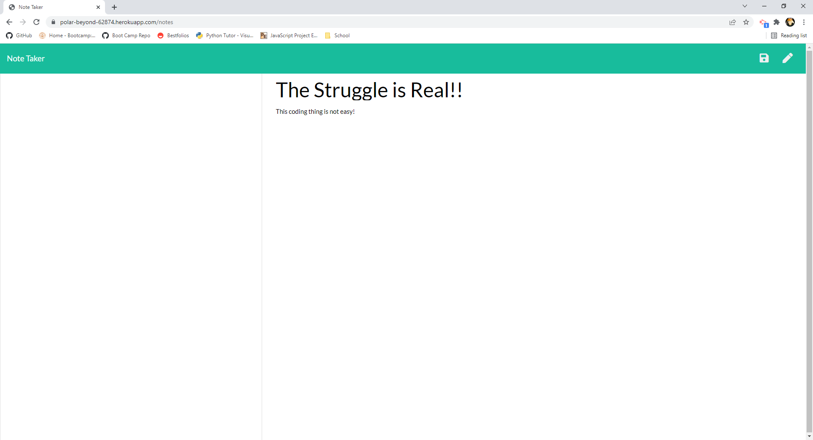
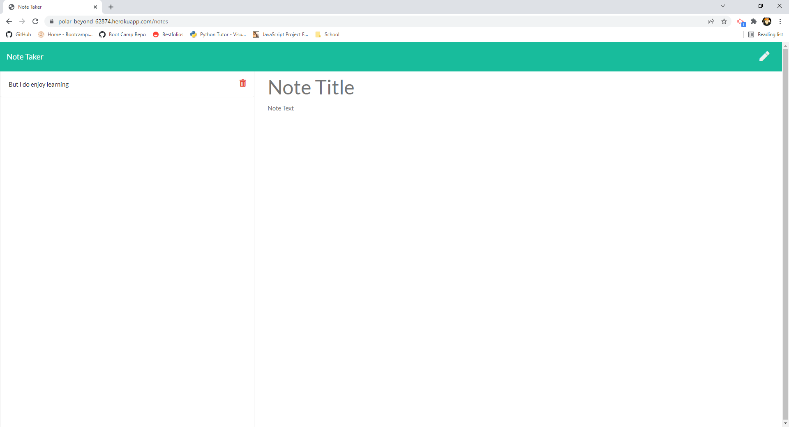

#  Note-Taker

##  Description

Note-Taker is an Express application which allows the user to create, view, and remove notes. Using Express, the note data is persistent until it is deleted by the user.

##  Table of Contents
* [Installation](#installation)
* [Usage](#usage)
* [Tests](#tests)
* [License](#license)
* [Contributors/Resources](#contributors)
* [Questions](#questions)

##  Installation

This application is hosted on Heroku and does not need to be installed locally.

##  Usage

To create the first note, a user will simply select the "Title" container and enter text. Then, they will do the same in the "Note" field. To save, the user will select the save button located at the top right corner of the screen. To add an additional note, the user will select the new note pencil also located at the top right. If a user chooses to delete a note, they will simply select the delete button which is located next to the note title.

Please see the video demonstration [here](https://watch.screencastify.com/v/GPFUkmW6FpLemeIk44hH).

##  Tests

No testing was performed

##  License

MIT

##  Contributors/Resources

Nigel Loch

##  Questions

If there are any questions about this project, please contact me at <nigelloch@gmail.com>. Thank you!

To see more of my projects, please visit my GitHub Repo at <https://github.com/nigelloch?tab=repositories>

  
